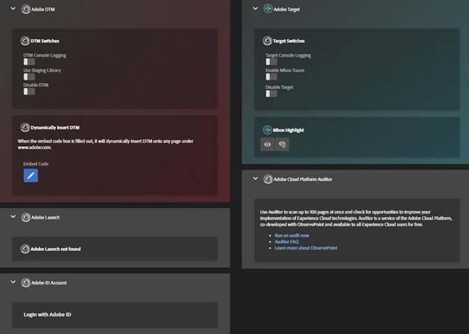

# 工具{#tools}

在“工具”屏幕上，您可以为已安装的解决方案启用或禁用各种工具。例如，您可以打开 Target 的控制台调试语句或使用 DTM 暂存库。只有在页面上安装了 Target 和 DTM 时，才提供这些工具。

您可以在任何页面上动态插入 Adobe Experience Platform Launch 或 DTM，以在未安装 Platform Launch 或 DTM 的页面上测试某些内容。单击 **[!UICONTROL Embed Code]** 图标，然后键入您的[嵌入代码](https://docs.adobe.com/content/help/zh-Hans/dtm/using/client-side/deployment.html)并单击 **[!UICONTROL Save]**。

## DTM 信息 {#section-c3d43040440449e5a050170843a600b7}

<table id="table_04625C3319134E169A35DB74C1D1FB31"> 
 <thead> 
  <tr> 
   <th colname="col1" class="entry"> 工具 </th> 
   <th colname="col2" class="entry"> 描述 </th> 
  </tr>
 </thead>
 <tbody> 
  <tr> 
   <td colname="col1"> 
 DTM 控制台日志记录 
 </td> 
   <td colname="col2"> 
此工具可向浏览器控制台提供特定于 DTM 的调试语句。 
 </td> 
  </tr> 
  <tr> 
   <td colname="col1"> 
使用暂存库 
 </td> 
   <td colname="col2"> 
此工具使用暂存库存储 DTM 调试信息。 
 </td> 
  </tr> 
  <tr> 
   <td colname="col1"> 
禁用 DTM 
 </td> 
   <td colname="col2"> 
此工具可阻止检查 DTM 信息。 
 </td> 
  </tr> 
  <tr> 
   <td colname="col1"> 
 动态插入 DTM 
 </td> 
   <td colname="col2"> 
 此工具可在页面上插入 DTM 代码。可以使用嵌入代码编辑器来编辑所插入的代码。 
 </td> 
  </tr> 
 </tbody> 
</table>

## Target 信息 {#section-31090d95f50e455692b672c26e6a2051}

<table id="table_A71D269B49F4417599EBACA44D5CCF4F"> 
 <thead> 
  <tr> 
   <th colname="col1" class="entry"> 工具 </th> 
   <th colname="col2" class="entry"> 描述 </th> 
  </tr>
 </thead>
 <tbody> 
  <tr> 
   <td colname="col1"> 
Target 控制台日志记录 
 </td> 
   <td colname="col2"> 
此工具通过向您的浏览器添加一个名为 mboxDebug=true 的 Cookie，可向浏览器控制台提供特定于 Target 的调试语句，所有语句均以 AT: 作为前缀。目前，控制台语句不显示在“Debugger 日志”屏幕中，而是显示在浏览器的原生调试控制台中。 
 
 此工具需要 0.9.6 以上版本的 at.js。如果您使用的是较低版本的 at.js，要启用控制台日志记录，可以向您的 URL 添加 ?mboxDebug=true 查询字符串参数。如果您使用的是 mbox.js，可添加 ?_AT_Debug=console 参数，以便启用控制台日志记录并仅限于记录可视化体验编辑器活动。 
 </td> 
  </tr> 
  <tr> 
   <td colname="col1"> 
 启用 Mbox 追踪 
 </td> 
   <td colname="col2"> 
此工具可向 Target 响应添加详细信息，这些信息可在 Debugger 的 Target &gt; Mbox 追踪屏幕中查看。 
 
 您必须已经在其中一个 Chrome 选项卡上登录到 Experience Cloud，才能启用此工具。 
 </td> 
  </tr> 
  <tr> 
   <td colname="col1"> 
禁用 Target 
 </td> 
   <td colname="col2"> 
此工具通过向浏览器添加一个名为 mboxDisable=true 的 Cookie 来禁用所有 Target 请求。 
 
 此工具需要 0.9.6 以上版本的 at.js。如果您使用的版本较低，可以通过向您的 URL 添加 ?mboxDisable=true 查询字符串参数来禁用 Mbox。 
 </td> 
  </tr> 
  <tr> 
   <td colname="col1"> 
 Mbox 高亮显示 
 </td> 
   <td colname="col2"> 
 此工具可在旧版包装样式的 Mbox 周围绘制一个红色框。 
 </td> 
  </tr> 
 </tbody> 
</table>

以下视频介绍了如何将 Debugger 扩展与 Adobe Target 结合使用。

>[!VIDEO](https://video.tv.adobe.com/v/23115t2/)
