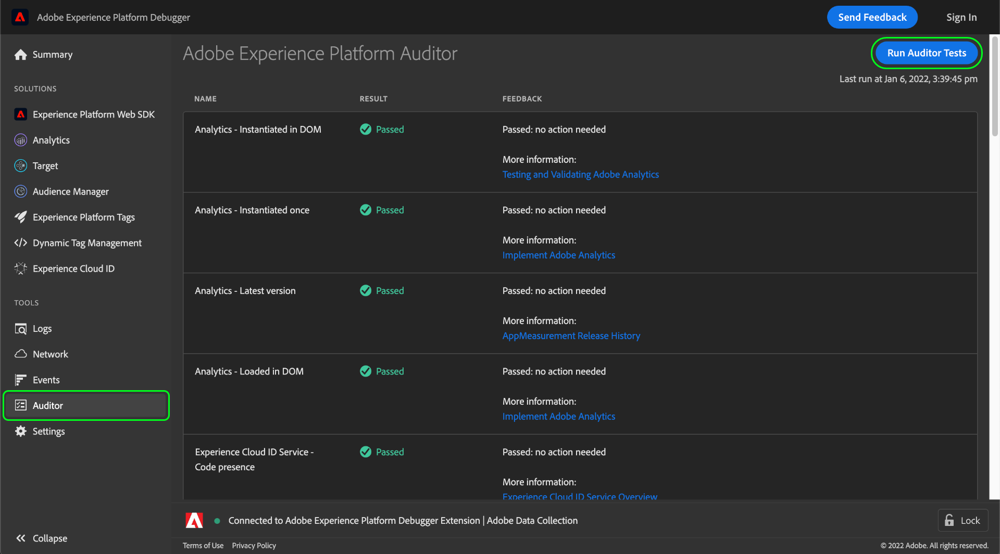

# Auditor

>[!IMPORTANT]
>
>Adobe Experience Platform Debugger 目前为 Beta 版。文档和功能可能会发生变化。

在Adobe Experience Platform Debugger中，您可以使用 **[!UICONTROL Auditor]** 选项卡，在您的页面上运行一系列审核测试。

要使用此功能，请执行以下操作：

1. 选择 **[!UICONTROL Auditor]** 中。
1. 选择 **[!UICONTROL Run Auditor Tests]**。测试完成后，其结果将显示在下面。

在结果列表上，显示了相应的测试及其结果，并提供了用来解决任意问题的建议。
