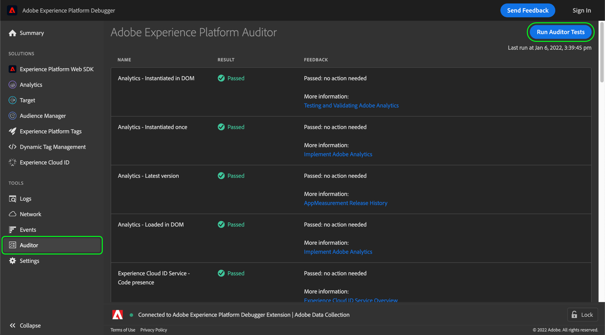

# Auditor选项卡

在Adobe Experience Platform Debugger中，您可以使用 **[!UICONTROL Auditor]** 选项卡，以在您的页面上运行一系列审核测试。

要使用此功能：

1. 选择 **[!UICONTROL Auditor]** 左侧导航栏中。
1. 选择 **[!UICONTROL Run Auditor Tests]**。测试完成后，其结果显示在下方。

在结果列表上，显示了相应的测试及其结果，并提供了用来解决任意问题的建议。

## 解释测试结果

每个测试经过加权处理，您的测试得分等于分配的权重。 如果您通过了一个权重为5的测试，那么您将获得5分。

| 得分 | 描述 |
| --- | --- |
| 0 | 提醒您应注意的问题，但不影响您的得分。 |
| 1 | 建议进行优化。 不影响数据准确性。 |
| 2 | 如果未通过此测试，则意味着您将无法访问Adobe Experience Cloud中的最新功能和修复。 |
| 3 | 测试效率以及实施是否遵循最佳实践。 |
| 4 | 失败表示您可能正在收集不可靠的数据。 |
| 5 | 失败意味着您可能会看到数据丢失。 |

所有测试要么通过，要么失败。 检测是否符合测试条件，不存在针对部分合规情况的分量得分。例如，在检测是否含有最新版本的 Adobe 解决方案时，如果您使用的版本与最新版本之间只相差一个版本，那么这种情况下您的得分与相关五个版本的得分是一样的。最新版本包括性能改进和错误修复，因此建议安装最新版本。

**强烈建议**&#x200B;修复任何 4 级或 5 级结果。

**建议**&#x200B;修复任何 1 级到 3 级的结果。

## 支持的Adobe技术

Auditor功能可以对以下Adobe技术进行评级：

* Adobe Advertising Cloud DSP
* Adobe Advertising Cloud Search
* Adobe Analytics
* Adobe Experience Cloud Identity Service
* Adobe Target
* 标记(以前称为Adobe Experience Platform Launch)

## 测试评分标准

有关此功能提供的测试评分标准的更多信息，请参阅以下文档：

* [标记一致性](./tag-consistency.md)
* [标记状态](./tag-presence.md)
* [配置](./configuration.md)
* [警报](./alerts.md)
