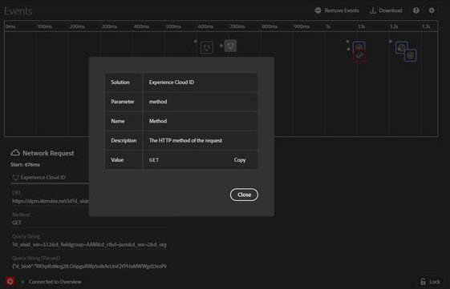

# 事件{#events}

>[!IMPORTANT]
>
>Adobe Experience Platform Debugger 目前为 Beta 版。文档和功能可能会发生变化。

“事件”屏幕提供了一个关于若干事件的图形化视图；其中，将按照时间线显示所发生的事件。

对于每个事件，时间线上都会显示一个与之适用的 解决方案图标。另外，还将显示反映数据层变更的图标（如果启用）。将鼠标悬停在图标上可获取相应事件的摘要信息。单击事件可了解更多详情。按住 Shift 键的同时单击或按住 Control 键的同时单击，可以查看多个事件。

单击详情，可获取更多信息。

## 跟踪数据层的变更

要在时间线上启用跟踪数据层变更，请执行以下操作：

1. 单击右上方的齿轮图标。
1. 输入数据层的名称。

   

1. 单击&#x200B;**[!UICONTROL 保存]**。

数据层变更详情将显示所有删除或添加的内容。您可以单击 **{}**，以便更加深入地了解数据层。

## 下载事件信息

单击&#x200B;**[!UICONTROL 下载]**&#x200B;可下载一个显示页面调用信息的Excel文件。
