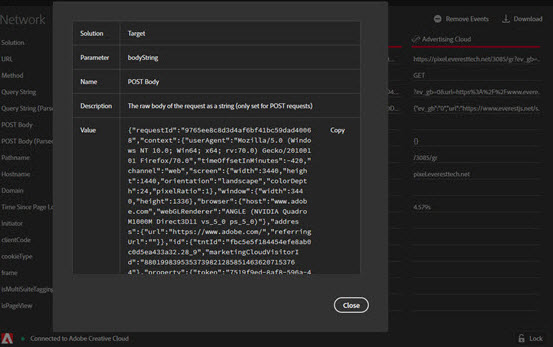

# 网络{#network}

>[!IMPORTANT]
>
>Adobe Experience Platform Debugger 目前为 Beta 版。文档和功能可能会发生变化。

要查看网络信息，请单击 **[!UICONTROL Network]**。

“网络”屏幕汇总页面上发出的所有 Adobe Experience Cloud 解决方案调用，并按从左到右的顺序显示。标准参数会自动标示友好名称，并按照相同的角色对常用参数进行分组。

这个屏幕可用来比较点击量中的键值对。您可以确认用于集成的参数（例如 Experience Cloud 访客 ID 或补充数据 ID）是否在集成中保持一致。

>[!NOTE]
>
>目前，并非所有在解决方案调用中传递的参数都在“网络”屏幕中可见，例如，Analytics 上下文变量、Target 自定义参数或 Experience Cloud ID 服务客户 ID。

要按解决方案更改信息，请从左侧导航列表中选择要查看的解决方案。以下是经过筛选，仅显示 Analytics 的示例：

要重新显示所有解决方案，请单击 **[!UICONTROL Network]**

单击“网络”视图中的项目可将其放大。从展开的视图窗口中，可以将显示的信息复制到剪贴板。

<!--Use the icon at the top of each column to copy the server call URL to your clipboard, where you can paste it into another document for reference or debugging purposes.

-->

要清除列表，请单击 **[!UICONTROL Remove Events]**。

要下载包含此屏幕上的信息的 Excel 文件，请单击 **[!UICONTROL Download]**。